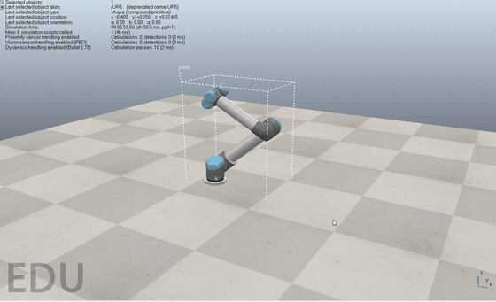

# Robot Kinematics Lab

A system that computes, mathematically, how a 6-DOF robot arm (UR5) reaches
a target 3D point, and verifies it live in a CoppeliaSim simulation.



*Dragging the UR5 in CoppeliaSim in real time with the mouse (see [Project 3](#project-3----real-time-teleoperation-in-coppeliasim--tremor-filter)).*

This project brings together robot math, control logic, and simulation:

1. A target point (X, Y, Z) is given.
2. Whether the target is reachable by the robot is checked (workspace check).
3. Inverse kinematics computes the required joint angles (q1...q6).
4. Joint limits are checked.
5. The angles are sent to the UR5 in CoppeliaSim along a smooth trajectory.
6. The actual end-effector position is read back, compared to the target, and the error is reported.

## Learning-oriented structure

This repo also doubles as a learning log: under `docs/lessons/` there are
notes that walk through the math behind each code module step by step. Each
lesson ships together with its corresponding code module and tests.

| # | Lesson | Code module |
|---|------|-----------|
| 1 | 3D Rotations | `src/kinematics/rotations.py` |
| 2 | Homogeneous Transformation Matrices | `src/kinematics/transforms.py` |
| 3 | DH Parameters and the UR5 | `src/kinematics/dh.py` |
| 4 | Forward Kinematics | `src/kinematics/forward.py` |
| 5 | Workspace / Reachability | `src/planning/workspace.py` |
| 6 | Jacobian | `src/kinematics/jacobian.py` |
| 7 | Inverse Kinematics | `src/kinematics/inverse.py` |
| 8 | Trajectory Planning | `src/planning/trajectory.py` |
| 9 | CoppeliaSim Connection | `src/simulation/coppelia_client.py` |
| 10 | Putting It All Together | `src/main.py` |

## Setup

```bash
python -m venv .venv
source .venv/bin/activate   # Windows: .venv\Scripts\activate
pip install -r requirements.txt
```

CoppeliaSim (the Student/Edu edition is enough) must also be installed. The
simulation connection uses CoppeliaSim's ZeroMQ Remote API.

## Tests

```bash
pytest tests/ -v
```

## Robot model

V1 uses a Universal Robots UR5, a 6-DOF serial manipulator.

## Status

**V1 is complete and verified on a real CoppeliaSim scene.**

The math/control side is done: rotations, homogeneous transforms, the UR5
DH model, forward kinematics, workspace/reachability checking, the
Jacobian, Jacobian-based numerical inverse kinematics, joint limit
checking, quintic trajectory planning, and a CoppeliaSim ZeroMQ Remote API
client. 60 tests pass (`pytest tests/ -v`).

Dry-run mode (no CoppeliaSim, pure Python math) works:

```bash
python -m src.main --target 0.42 0.18 0.36
```

The real CoppeliaSim connection (`--sim`) also works and has been verified
-- on the user's own UR5 scene the target was reached with **0.50mm** error
(`TARGET REACHED`):

```bash
python -m src.main --target -0.1 0.5 0.4 --sim
```

### Why a "calibrated" kinematic chain?

On the first attempt, a ~780-1200mm discrepancy was found between the
literature DH parameters for the UR5 and the actual geometry of
CoppeliaSim's ready-made UR5 model: even at `q=0` the two models' end-effector
positions didn't match, because CoppeliaSim's model has a different
"zero-angle" pose (arm vertical/bent) than the one the DH table assumes
(arm horizontal).

Rather than guessing/hand-tuning, an **empirical calibration** approach was
used instead: `CoppeliaSimClient.calibrate_local_transforms()` reads each
joint's real mounting transform relative to the previous one directly from
the scene at connection time (while the joints are still at q=0);
`CalibratedUR5Robot` then solves IK using this chain (via the numerical-
Jacobian-based `inverse_kinematics_generic`, not an analytic one). This way
the DH table is only used in dry-run mode -- `--sim` mode relies entirely on
the scene's own real geometry.

### Notes on connecting to CoppeliaSim

1. Open CoppeliaSim, add the `robots > non-mobile > UR5` model to your scene
   from the Model Browser (fresh/unmoved, q=0).
2. `pip install coppeliasim-zmqremoteapi-client`
3. `python -m src.main --target X Y Z --sim`

Precondition: the calibration assumes the joints are at q=0 at connection
time -- so open the scene fresh before running `--sim` (not with angles left
over from a previous run).

---

## V2 -- Custom Robotics Math & Motion (research layer)

V1 ran the "give a target -> solve IK -> move -> measure error" pipeline
without depending on CoppeliaSim's built-in IK solver. V2 adds a
research/simulation layer that implements ALL of this math (Jacobian, IK,
singularity/manipulability analysis, Cartesian trajectory, velocity
control) from scratch in Python, without relying on ready-made libraries:

```text
Target Pose (6D: position + orientation)
   |
Custom IK Solver (Pseudoinverse / DLS / Jacobian Transpose)
   |
Geometric Jacobian (analytical, verified against finite differences)
   |
Singularity / Manipulability / Joint Limit Analysis
   |
Cartesian Trajectory (quintic position + SLERP orientation)
   |
Velocity / Resolved-Rate Controller
   |
CoppeliaSim Robot
   |
Actual Pose
   |
Error + Performance Analysis (+ CSV export)
```

V2's math/control layer (V2.1 + V2.2 + V2.3) is now complete and verified
with 133 tests. `--sim` mode still uses V1's calibrated, position-only path
(verified on real hardware, 0.5mm error) -- V2's new features (orientation
targets, solver selection, etc.) are for now available in **dry-run** mode
only; let me know if you'd like these hooked up to the live CoppeliaSim
connection too, and we can add orientation support to the calibration chain.

### V2.1 -- Custom Robotics Math

**Three IK solvers**, all written from scratch and sharing the same
interface (`src/kinematics/ik_pseudoinverse.py`, `ik_dls.py`,
`ik_jacobian_transpose.py`):

- **Jacobian Pseudoinverse**: `dq = J^+ e` -- the simplest, but can blow up
  near singularities.
- **Damped Least Squares (DLS)**: `dq = J^T (JJ^T + lambda^2 I)^-1 e` --
  numerically stable near singularities, preferred for precision-sensitive
  applications.
- **Jacobian Transpose**: `dq = alpha* J^T e` (alpha* is computed
  automatically via the Wolovich & Elliott optimal step-size formula) --
  never needs a matrix inverse, the fastest/cheapest but slowest-converging
  method.

Running `python -m src.main --target 0.42 0.18 0.36 --benchmark` compares
all three on the same target -- a real (generated) example output:

| Solver | Iterations | Position Error | Time |
|---|---:|---:|---:|
| Jacobian Pseudoinverse | 19 | 0.00 mm | 5.0 ms |
| Damped Least Squares | 13 | 0.05 mm | 3.1 ms |
| Jacobian Transpose | 25 | 0.06 mm | 5.1 ms |

**6D pose targets**: it's no longer just X/Y/Z -- a full orientation can now
be targeted too, via `--orientation ROLL PITCH YAW` (degrees). The
orientation math (`src/kinematics/orientation.py`) is quaternion-based:
rotation matrix <-> RPY <-> quaternion conversions, quaternion algebra
(multiplication, conjugate), and the angular error vector IK uses
(`orientation_error`) were all written from scratch.

The **Geometric Jacobian** (`src/kinematics/jacobian.py`) isn't pulled from
a library -- it's computed from our own forward-kinematics chain via
`J_v_i = z_{i-1} x (o_n - o_{i-1})`, `J_w_i = z_{i-1}`. We verify it against
an independent **numerical (finite-difference) Jacobian**
(`numerical_jacobian.py`) -- the analytical and numerical Jacobians match
to within `1e-4` across 10 random configurations
(`tests/test_numerical_jacobian.py`).

### V2.2 -- Robot Intelligence

- **Singularity detection** (`src/analysis/singularity.py`): SVD-based
  analysis (`sigma_min`, condition number `kappa = sigma_max/sigma_min`),
  reporting `SAFE` / `NEAR SINGULARITY` / `SINGULAR` status.
- **Yoshikawa manipulability** (`src/analysis/manipulability.py`):
  `w(q) = sqrt(det(J J^T))`, cross-checked against the product of singular
  values.
- **Joint Limit Avoidance** (`src/control/joint_limit_avoidance.py`): a
  secondary objective via null-space projection -- `dq = J^+ e + (I - J^+J) z`,
  where `z` pushes joints toward the center of their range without
  disturbing the primary (pose) task. Try it with `--solver joint_limit_avoidance`.
- **Multiple IK Solutions** (`src/kinematics/ik_multi_start.py`): solves the
  same target from several different starting points (structural + random
  "seeds") and picks the best configuration using
  `cost = w1*E_pose + w2*E_joint_motion + w3*(1/manipulability)`
  (`--multi-start`).

### V2.3 -- Motion

- **Cartesian Trajectory** (`src/planning/cartesian_trajectory.py`): the
  end-effector can now follow a straight line in Cartesian space instead of
  joint space (`p(t) = p0 + s(t)(pf-p0)`), using quintic time scaling
  (`src/planning/quintic.py` -- zero velocity/acceleration at the endpoints).
- **Quaternion SLERP** (`src/planning/slerp.py`): orientation is
  interpolated at constant angular velocity in step with position;
  `cartesian_pose_trajectory()` combines both into a full 6D Cartesian
  trajectory.
- **Resolved-Rate (velocity) Control** (`src/control/resolved_rate.py`):
  `q_dot = J^+ x_dot` -- given a target Cartesian VELOCITY instead of a
  target position, computes the required joint velocities. The core
  building block for real-time mouse/gamepad teleoperation; now wired up
  to a live control loop (see Project 3 below).
- **Motion Scaling** (`src/control/motion_scaling.py`): `robot_motion =
  master_motion * scale_factor` (with ready-made `1:1`/`2:1`/`5:1`/`10:1`
  presets) -- the foundation layer for Project 3 (Surgical Tremor Filter).

### CSV Export

Any non-`--sim` run can also be logged to a CSV via `--csv path/to/log.csv`
through `src/analysis/csv_logger.py` (target, actual position,
position/orientation error, q1..q6, condition number, manipulability,
solver name, iterations, converged).

### V2 example commands

```bash
# 6D pose target (position + orientation)
python -m src.main --target 0.42 0.18 0.36 --orientation 90 15 -30

# Solver selection
python -m src.main --target 0.42 0.18 0.36 --solver transpose

# Joint-limit-avoidance (null-space) solver
python -m src.main --target 0.42 0.18 0.36 --solver joint_limit_avoidance

# Solve from multiple starting points, keep the best configuration
python -m src.main --target 0.42 0.18 0.36 --multi-start

# Compare the three solvers (doesn't move the robot)
python -m src.main --target 0.42 0.18 0.36 --benchmark

# Also log the result to CSV
python -m src.main --target 0.42 0.18 0.36 --csv results/log.csv
```

If no V2 flag is given (no `--orientation`/`--solver`/`--multi-start`/
`--benchmark`), both dry-run and `--sim` mode behave exactly like V1 --
the path verified on real hardware is untouched.

### Test status

**147 tests pass** (`pytest tests/ -v`) -- on top of V1's 60 tests:
orientation/quaternion math, analytical vs. numerical Jacobian
verification, convergence of all three IK solvers for both position-only
and full 6D pose targets, singularity/manipulability analysis, null-space
joint-limit-avoidance, multi-start IK scoring, quintic time scaling,
Cartesian trajectory, SLERP, resolved-rate control, motion scaling, the
tremor filter, the mouse-teleoperation control math, the benchmark table,
and CSV export.

---

## Project 3 -- Real-Time Teleoperation in CoppeliaSim + Tremor Filter

The last piece V2 left on the table: a live teleoperation loop that
connects the mouse to the UR5 in CoppeliaSim, with a **surgical tremor
filter** layered on top.

```text
Mouse movement (pixels)
   |
Motion Scaling (1:1 / 2:1 / 5:1 / 10:1)
   |
Tremor Filter (2nd-order Butterworth low-pass, ~2 Hz cutoff)
   |
Target Cartesian velocity
   |
Resolved-Rate IK (J^+, using the Jacobian calibrated from the scene)
   |
Joint velocity -> integrated and sent to CoppeliaSim as a position command
```

### Tremor Filter (`src/control/tremor_filter.py`)

Physiological hand tremor typically sits around 8-12 Hz; intentional hand
motion is usually below 2-3 Hz. A 2nd-order Butterworth low-pass filter
with a cutoff in between (2 Hz by default) suppresses tremor heavily while
passing intentional motion through with almost no lag. Verified with a
synthetic "surgeon's hand" signal (slow intentional motion + tremor +
measurement noise):

```bash
python -m src.main --tremor-demo
```

real (generated) output:

```text
Tremor Filter Demo (synthetic surgeon's-hand signal):
Cutoff Frequency   = 2.0 Hz (sample rate: 100 Hz)
Raw RMS            = 0.6656
Filtered RMS       = 0.6552
Tremor Band Reduction (6-14 Hz) = 98.4%
```

98.4% of the energy in the tremor band is filtered out, while the signal's
overall RMS (mostly the intentional motion) barely changes -- i.e. the
filter genuinely does "drop the tremor, keep the motion." A complementary
`DeadbandFilter` (a simple threshold filter that zeroes out very small
movements entirely) is also included, for comparison.

### Mouse Teleoperation (`src/teleoperation/mouse_teleop.py`)

```bash
python -m src.teleoperation.mouse_teleop                       # default: 5:1 scale, tremor filter ON
python -m src.teleoperation.mouse_teleop --scale 10:1           # more precise (10:1 scale)
python -m src.teleoperation.mouse_teleop --no-tremor-filter     # unfiltered, for comparison
python -m src.teleoperation.mouse_teleop --rate 30 --sensitivity 0.003
```

Drag the mouse left/right -> the robot moves along world X; drag up/down ->
it moves along world Z (depth/Y is fixed for now). Press ESC to quit (or
Ctrl+C). The connection uses the same empirical scene calibration as
`--sim` mode (`CalibratedUR5Robot`) -- so it doesn't matter if the robot has
been moved/rotated in the scene; the only precondition is that the joints
are at q=0 before teleoperation starts.

The control loop's math (`teleop_control_step`) was written as a pure
function, independent of pynput/CoppeliaSim, and is fully covered by tests:
verified that mouse direction maps to the correct axis, that motion scaling
shrinks movement by the right ratio, that joint limits are always
respected, and that the tremor filter damps oscillating (tremor-like) input
by about 70x. The pynput/CoppeliaSim I/O layer (`run_mouse_teleoperation`),
however -- like `coppelia_client.py` before it -- needed a real mouse and a
real CoppeliaSim instance, so it may need a small tuning/debugging pass on
first run.

Requires `pip install pynput` (already added to requirements.txt).
